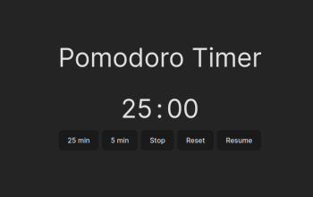

# Pomodoro Timer Application

The Pomodoro Timer is a simple yet effective tool designed to enhance productivity through the Pomodoro Technique. This technique involves working for focused periods (traditionally 25 minutes), followed by short breaks (typically 5 minutes).

## Features

- 25-Minute Timer: Ideal for focused work or study sessions. After completing a 25-minute session, the timer will automatically redirect you to a alarm video on YouTube.
- 5-Minute Timer: Designed for short breaks between work sessions. After the break, you're encouraged to resume your focused work session.
- Pause/Resume Functionality: Pause the timer at any moment and resume where you left off, maintaining flexibility during your workflow.
- Reset Option: Reset the timer to start a fresh session whenever needed.

\*picture of application

## Getting Started

To run the Pomodoro Timer Application locally, follow these steps:

1. Clone the repository to your local machine.

2. Navigate to the project directory in your terminal.
3. Run `npm install` to install the necessary dependencies.
4. Start the development server with `npm start`.
5. Open your web browser and go to `http://localhost:5173/` to view the application.

## Usage

Upon launching the application, you will be greeted with a simple interface displaying the current timer status. Below the timer, you will find buttons to control the timer:

- 25 min: Start a 25-minute focused work session.
- 5 min: Initiate a 5-minute break.
- Stop: Pause the ongoing timer.
- Reset: Reset the timer to its initial state.
- Resume: Resume the timer from where it was paused.

After completing a 25-minute session or a 5-minute break, the application will automatically open a YouTube video in a new tab, signaling the transition between work and break periods.

Enjoy enhancing your productivity with the Pomodoro Timer Application!
